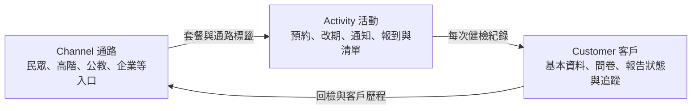
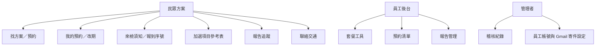
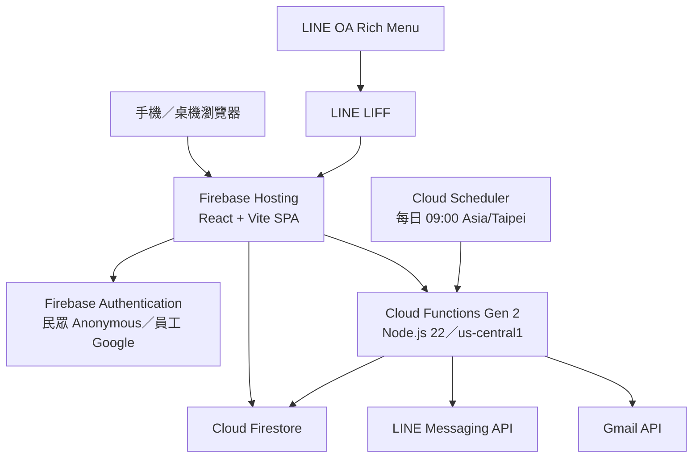
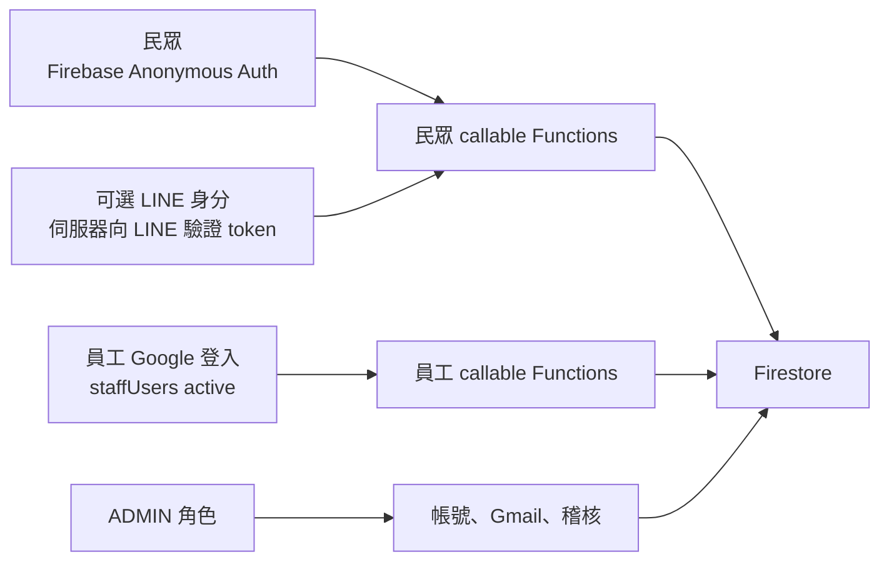
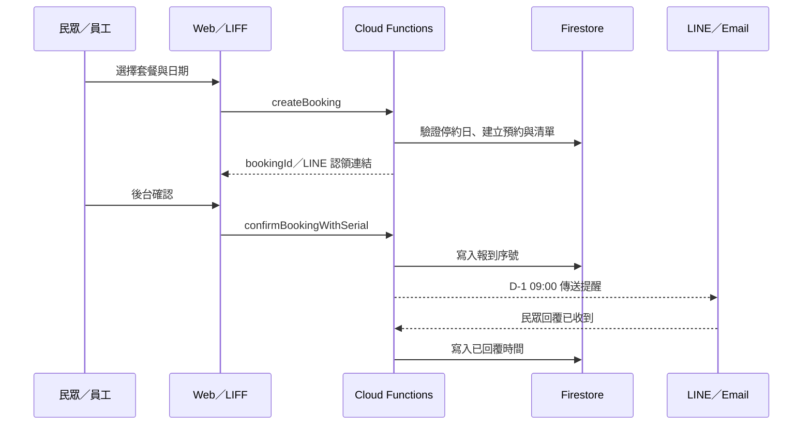
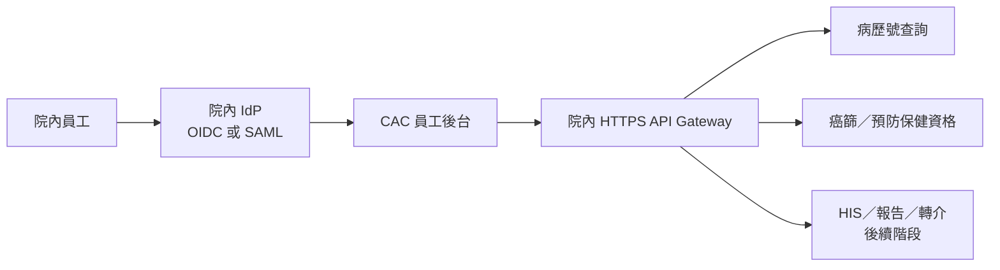

# CAC 系統架構與需求查核

> 更新日期：2026-08-20  
> 線上系統：<https://channel-activity-customer.web.app/>  
> 現行計畫：[健檢中心三層數位系統 Implementation Plan v2.2（2026 下半年）](../健檢中心三層數位系統%20Implementation%20Plan%20v2.2（2026%20下半年）.md)  
> 資訊室對接細節：[IT_INTEGRATION_GUIDE.md](IT_INTEGRATION_GUIDE.md)

本文件使用多張小型 Mermaid 圖，避免單張圖過寬而難以閱讀。「已上線」、「待對接」與「後續規劃」分開標示，不把規劃中的功能當成現況。

## 1. CAC 三層業務架構

目前是可運作的 **Channel → Activity 預約 MVP**，並已開始建立 Customer 層的問卷與報告狀態；尚未成為完整 HIS、健檢報告與個管師 CRM。

## 2. 對應現有 UI

### 已上線

- 民眾：套餐篩選、卡片／總表比較、預約、改期、取消、報到序號、套餐對應來檢須知、問卷與報告狀態。
- 員工：套餐／項目／問卷管理、預約區間查詢、CSV 匯入匯出、停止預約日、確認與報到序號、提醒、個人化清單／問卷列印。
- 管理者：員工啟用／停用與角色、Gmail 寄件授權、預約操作稽核搜尋。

### 待對接

- 院內 `@ptch.org.tw` 單一登入。
- 院內鏡像名額、Email/OTP 我的預約、問卷 CSV 回傳與個管 CRM（依 v2.2 分階段推進）。
- HIS 病歷號查詢、正式報告與轉介資料串接。

## 3. 技術元件與部署

### 程式邊界

| 檔案 | 責任 |
| --- | --- |
| `src/App.jsx` | 目前的頁面組合根、共享狀態、modal、列印與主要互動 handler |
| `src/components/PackageComparison.jsx` | 民眾套餐比較表的排序、詳情與預約入口呈現 |
| `src/components/PublicQuickLinks.jsx` | 民眾導覽快捷鍵與 LINE 連結入口呈現 |
| `src/components/ContactInfoPanel.jsx` | 民眾聯絡與交通的靜態內容、地圖與導航連結 |
| `src/core.js` | CSV 解析、計價、套餐標籤／比較、清單與來檢須知規則 |
| `src/questionnaire.js` | 問卷 schema、欄位驗證、跨次帶入與列印 |
| `src/firebase.js` | Firebase SDK、Firestore 查詢與 callable Functions 封裝 |
| `src/liff.js` | LIFF 初始化、LINE 登入與 access token |
| `functions/index.js` | 信任邊界：預約寫入、權限驗證、LINE／Gmail、排程與稽核 |
| `firestore.rules` | 防止民眾直接覆寫預約；限制員工與管理者資料存取 |

## App.jsx 拆分原則

- 先抽出只有 props 與畫面事件的低耦合元件；`PackageComparison` 與 `PublicQuickLinks` 是第一個已驗證切片。
- 以一個垂直功能為單位抽離並完成 build 與瀏覽器 smoke test；不要依固定行數或畫面名稱硬切。
- 只有 state、effects 與 handler ownership 明確時才建立 feature hook，避免為拆檔增加通用 hook 或 prop drilling。
- v2.2 是現行業務 roadmap；v2.0/v2.1 僅保留在 `docs/archive/plans/` 作歷史依據。
## 4. 身分與權限邊界

- 民眾預約、取消、改期申請與問卷不直接寫入 Firestore，改由 Cloud Functions 驗證與寫入。
- LINE ID 是可選的聯絡／認領方式；沒有 LINE 時可用 Email，員工 CSV 匯入可先無 LINE／Email。
- 員工目前用 Google 登入，並需 `staffUsers/{email}` 為啟用狀態。改用院內帳號後，仍保留 `STAFF` / `ADMIN` 的應用層授權。
- `lhm0323@gmail.com` 仍是原始 bootstrap admin；院內 SSO 驗收完成前不可直接移除，否則可能鎖死後台。

## 5. 預約與 D-1 通知流程

Email 現況需區分：

- 員工建立預約後的 LINE 認領信：已串 Gmail API。
- D-1 Email：現行程式寫入 `mail` 佇列，穩定寄送 worker 尚待確認；LINE D-1 為目前主要已驗收通道。

## 6. Firestore 資料分區

```mermaid
flowchart TB
  Identity["身分與權限"] --> StaffUsers["staffUsers"]
  CustomerData["客戶與預約"] --> Customers["customers"]
  CustomerData --> Bookings["bookings"]
  CustomerData --> Checklists["checklists"]
  Operations["營運"] --> Blocked["bookingBlockedDates"]
  Operations --> Changes["bookingChangeRequests"]
  Operations --> Counters["dailyCheckInCounters"]
  Catalog["套餐與問卷"] --> Packages["managedPackages"]
  Catalog --> Items["managedItems"]
  Catalog --> Questionnaires["managedQuestionnaires"]
  Catalog --> Responses["customerQuestionnaireResponses"]
  Control["稽核與系統"] --> Audit["auditLogs"]
  Control --> Settings["systemSettings／settings"]
```

| 分類 | collections | 敏感性與主要存取 |
| --- | --- | --- |
| 個人／預約 | `customers`, `bookings`, `checklists` | 個資；民眾限 owner，員工限 active staff |
| 健康問卷 | `managedQuestionnaires`, `packageQuestionnaireRules`, `customerQuestionnaireResponses` | 健康資料；回答不寫入 audit log |
| 套餐 | `managedPackages`, `managedItems`, `packageInvites` | 公開、內部或邀請限定；修改限員工 |
| 營運 | `bookingBlockedDates`, `bookingChangeRequests`, `dailyCheckInCounters` | 停約、改期、報到序號 |
| 權限／稽核 | `staffUsers`, `auditLogs` | `auditLogs` 僅 ADMIN 可讀 |
| 通知／系統 | `mail`, `systemSettings/mailer`, `mailerAuthorizationStates` | OAuth 敏感值加密；不得在前端或 Git 放置 secret |

## 7. 對接後的目標架構

對接原則：瀏覽器不直接呼叫院內 HTTP API；院內密碼、健保 Token、完整身分證號不放入前端或 URL。由院內提供經身分驗證的 HTTPS 關口，並保留查詢人、時間、目的與結果狀態的稽核紀錄。

## 8. 明確尚未完成

- 院內 SSO 與離職帳號即時停用。
- 癌篩 API：v2.2 明確延後，尚未啟動 HTTPS 關口、病歷號前置查詢或健保 DLL token。
- 正式報告檔案、異常分級、轉介與個管師待辦。
- 企業 CSV 名單的每人一次性認領 QR、到期與批次追蹤完整流程。
- 每日／時段容量上限與各站完成／檢體交接。
- 正式備份、PITR 與生產／備援定期復原演練。`cac-health-staging` 是測試環境，不是目前的即時鏡像備份。
