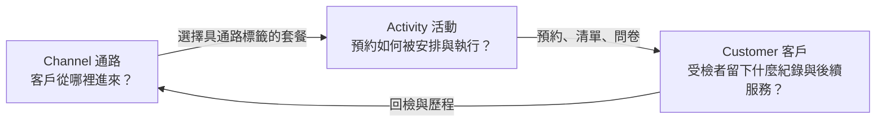
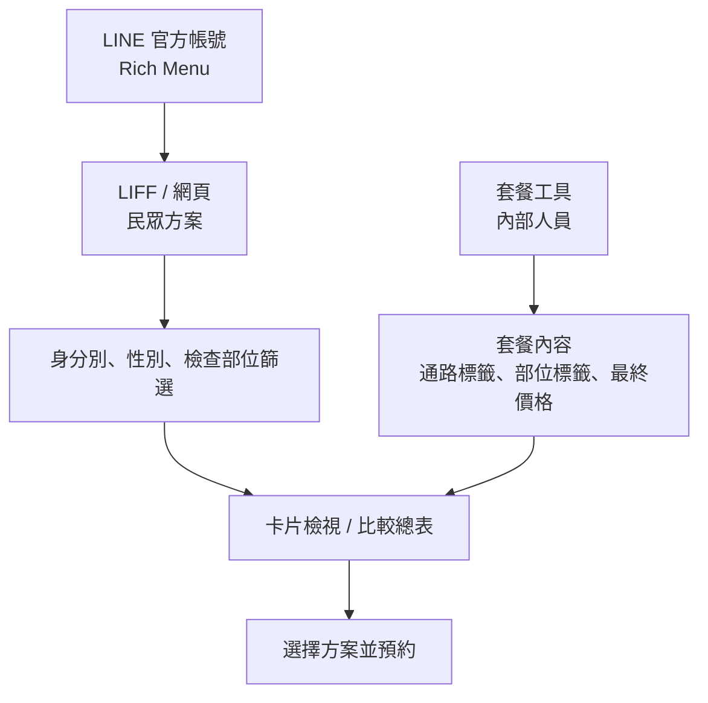
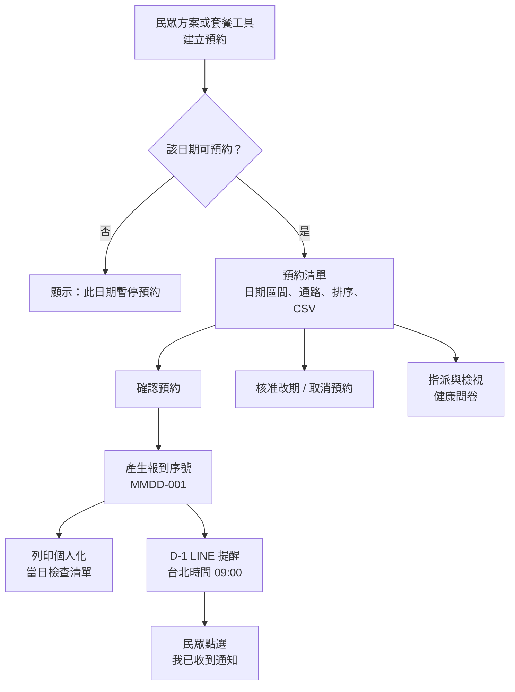
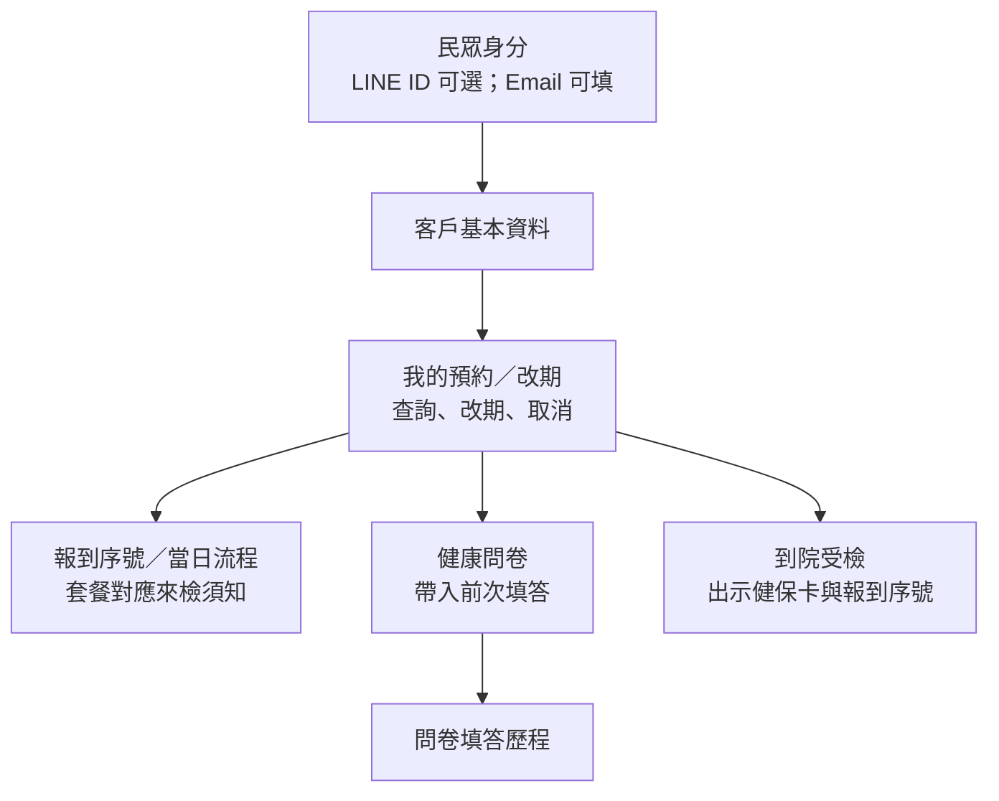
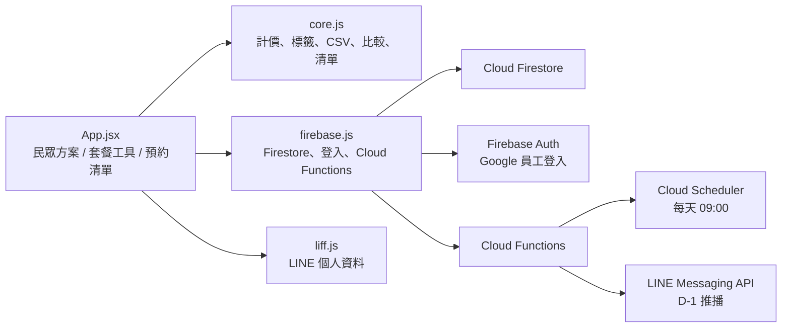

# CAC 專案架構與需求查核

本文件刻意拆成多張小圖。不要合併成一張圖，否則 Mermaid 會縮小字體而無法閱讀。

## 1. CAC 三層總覽

## 2. Channel：對應「民眾方案」與「套餐工具」

**已完成：** LINE OA deep link、民眾方案、套餐篩選、卡片檢視、比較總表、套餐工具編修套餐與項目。

**尚未完成：** 通路負責人 CRM、企業合約／名單版本管理、通路轉換成效儀表板。

## 3. Activity：對應「預約清單」

**已完成：** 停止預約日期、預約清單、確認與報到序號、個人化清單列印、CSV 匯入匯出、改期／取消、D-1 LINE 提醒、問卷。

**尚未完成：** 各站完成狀態、檢體交接追蹤、時段／容量管理、多人即時控場儀表板。

## 4. Customer：對應「我的預約／改期」與 Rich Menu

**已完成：** 客戶基本資料、我的預約／改期、取消預約、套餐對應須知、問卷歷程、D-1 已讀回覆。

**尚未完成：** 健檢報告匯入、異常結果追蹤、轉介流程、個管師待辦清單、長期個人健康紀錄。

## 5. 技術實作：程式、資料與自動化

### 主要 Firestore 資料

| 對應功能 | 資料表 |
| --- | --- |
| 客戶與預約 | `customers`、`bookings`、`checklists` |
| 套餐工具 | `managedPackages`、`managedItems` |
| 預約清單營運 | `bookingBlockedDates`、`bookingChangeRequests`、`dailyCheckInCounters` |
| 員工登入 | `staffUsers` |
| 健康問卷 | `managedQuestionnaires`、`packageQuestionnaireRules`、`customerQuestionnaireResponses` |
| Email 提醒 | `mail` 目前只是佇列，尚未串接真正寄信服務 |

## 結論

目前 CAC 是可運作的 **Channel → Activity 預約 MVP**，並已建立 Customer 層的前段資料與問卷歷程；它尚不是完整的健檢報告、異常追蹤與個管師管理平台。