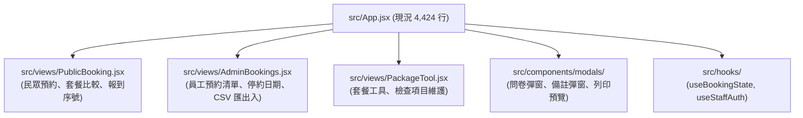
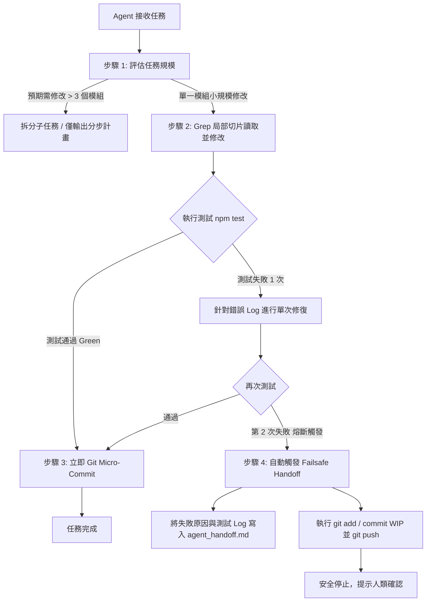

# CAC 專案 Token 節約與 Agent 自動防呆交接策略 (Proposal)

> **文件狀態**：規劃與 Review 提案（供與 Codex 評估討論）  
> **適用專案**：`Channel–Activity–Customer` (`cac-liff-app`)  
> **建立日期**：2026-08-20  

---

## 1. 現況問題與 Token 耗盡主因診斷

| 痛點維度 | 現況事實 | 對 Token 的實質衝擊 |
| :--- | :--- | :--- |
| **代碼巨石** | `src/App.jsx` 高達 **4,424 行 / 275.1 KB**。 | Agent 只要調用一次讀取，單次就消耗 **65,000 ~ 75,000 tokens**，2~3 次對話即耗盡 Context/Quota。 |
| **架構表粒度過粗** | `docs/CAC_ARCHITECTURE.md` 雖然有程式邊界表，但「民眾端、員工端、Modal、列印、主要狀態」全部指向 `src/App.jsx`。 | Agent 即使查閱了架構表，最終仍被迫載入 275KB 的整份檔案。 |
| **文件歷程膨脹** | `agent_handoff.md` (35.1 KB) 與 `docs/PROGRESS.md` (40.8 KB) 長期累積歷史紀錄。 | 每次啟動新 turn 時，讀取歷程文件就先佔去 20,000+ tokens。 |
| **缺乏失敗熔斷** | 跨邊界（前端 UI $\leftrightarrow$ Functions $\leftrightarrow$ Firestore Rules）修改報錯時，Agent 自行反覆重試或開平行 Agent。 | 失敗重跑產生大量重複讀取的 token 浪費，且中途撞 Quota 時進度全部遺失。 |
| **手動防呆不可行** | 人類在專注推進功能與驗收時，無法隨時記得打 `/status` 監控 Quota。 | 缺乏 Agent 端「主動式」的防呆與中斷安全交接機制。 |

---

## 2. 核心架構優化：`App.jsx` 漸進式模組化拆分

不一次性推翻代碼，由 Codex 依下列優先權分批拆分：



### 拆分後的效益：
- 未來修改「問卷彈窗」，Agent 只需載入 `QuestionnaireModal.jsx` (約 5KB / 1,200 tokens)，**單次 Token 讀取降低 95%**。
- `docs/CAC_ARCHITECTURE.md` 的程式邊界表同步更新為細部路徑，讓 Agent 查表能精確定位小檔案。

---

## 3. Agent 端主動防呆與自動 Handoff 協議 (Failsafe Protocol)

針對「使用者不會定時手動檢查 `/status`」的現實，將防呆責任內化為 Agent 的執行約束：



### 四大防呆機制細部規範：

#### ① 切片讀取原則（Slice-Reading Only）
- **禁止全文讀取**：對超過 500 行的檔案（如現階段的 `App.jsx`），嚴禁直接整檔 `view_file`。
- **強制執行路徑**：先以 `grep` 定位目標函式或關鍵字行號 $\rightarrow$ 僅讀取該行號前後 50 行（切片讀取）進行修改。

#### ② 綠燈微提交（Micro-Commit on Green）
- 嚴禁累積所有修改才一次 commit。
- 只要修改完單一函式或單一組件且 `npm test` 通過，**立刻執行 `git commit -m "feat/fix: [模組名] 具體說明"`**。
- **目的**：即使下一秒遭遇不可抗力（Quota 耗盡、網路中斷），已完成的工作 100% 保存在 Git 節點上。

#### ③ 兩次失敗熔斷機制（2-Strike Failure Circuit Breaker）
- 若修改後測試失敗，Agent 最多僅能分析錯誤 Log 嘗試修復 **1 次**。
- 若第 2 次測試依然失敗，**強制停止重試，禁止發起第 3 次修改或平行 Agent**。

#### ④ 自動化優雅交接（Automated Graceful Handoff & Push）
- 當觸發熔斷或執行結束時，Agent 必須保留最後的動作執行：
  1. 將進度更新至 `agent_handoff.md`（遵循極簡格式）。
  2. 執行 `git add . && git commit -m "wip: checkpoint before handoff" && git push`。
  3. 回報已安全存檔，標註停下來的具體問題點。

---

## 4. 文件瘦身與歷程分級管理

將目前過度肥大的文件重新組織，避免每次浪費 Context：

```
docs/
├── CAC_ARCHITECTURE.md       # 保持最新，粒度精確到組件級 (控制在 8 KB 內)
├── PROGRESS.md               # 核心進度
└── archive/                  # 歷史封存區 (Agent 默認不需讀取)
    ├── PROGRESS_2026_Q2.md
    └── HANDOFF_HISTORY.md
```

- **`agent_handoff.md`（根目錄）精簡規範**：
  - 長度嚴格控制在 **50 行以內**。
  - 僅包含：
    1. 當前已通過的最新 Commit Hash 與功能。
    2. 下一位 Agent 應執行的第 1 件事（明確指出檔案與行號區間）。
    3. 執行驗證指令（如 `npm test`）。

---

## 5. 使用者（Prompt 端）的極簡搭配指令

使用者下需求時無需記住檔案路徑，只需在需求後加上標準約束句：

> **需求**：`[描述業務需求與驗收條件]`  
> **約束**：`請遵循切片讀取，測試通過立即 micro-commit；若連續 2 次測試未過請立即更新 handoff 並 commit push 停下。`
