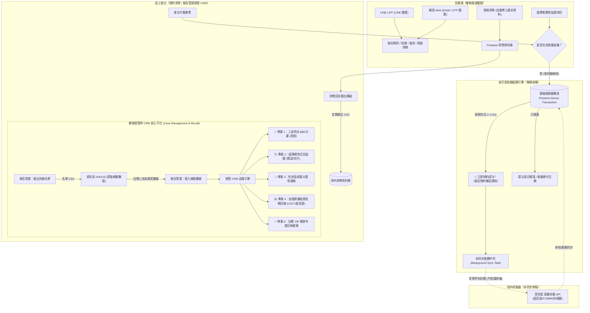

# 健檢中心三層數位系統 Implementation Plan v2.2（2026 下半年）

> **版本**：v2.2（2026-08-19 產出，依個管師 CRM 定位與非同步架構升級）  
> **依據**：2026-08-19 健檢中心與資訊室會議決議制定  
> **核心聚焦**：
> 1. **限量檢查設備存量控管**：採「雲端配額鏡像 ＋ 毫秒級扣額 ＋ 背景非同步拋轉」，防止院內慢速 API 阻擋民眾預約（完成預約時**不給予**報到序號，純確認預約紀錄）。
> 2. **民眾預約雙軌查詢**：開放「手機 + LINE」與「網頁 + Email / OTP」兩條路線查詢、改期、取消與填問卷。
> 3. **問卷院內資料庫回存**：採行方案 (b)——維持 Firebase 問卷填寫（保留自動帶入前次填答體驗），建立標準 CSV 匯出模組回存院內資料庫。
> 4. **報告管理升級「個管師 CRM 工作台」**：以國家「三高防治 888 計畫」為首發核心，同時**全面架構化預留「癌篩陽追、危急值、高階影像結節、VIP年度回檢」等多專案個管 CRM 擴充性**。
> 5. **癌症篩檢資格 API**：暫緩實作，維持受檢者健檢當天現場插健保卡查詢流程。

---

## 1. 會議決策與範疇異動

| 決議要點 | 決策內容 | CAC 系統因應與實作方向 |
|---|---|---|
| **1. 癌篩資格查詢** | 暫緩串接，維持現場插卡 | 暫不更動 CAC 預約端；維持由診間/現場 HIS 插健保卡進行即時資格檢核。 |
| **2. 限量設備存量控管** | 資訊室提供 API，採非同步架構 | 串接超音波、CT、MRI、內視鏡等設備存量。**採用雲端鏡像毫秒級扣額＋背景非同步拋轉**，徹底避免院內 API 連線延遲（約 15~30s）導致前端卡死。完成預約時直接建立預約，不發放現場報到序號。 |
| **3. 民眾預約雙軌查詢** | 開放 Email / 網頁查詢 | 「我的預約」新增 Email / 手機 + 一次性安全驗證碼（OTP）登入通道，免登 LINE 亦可查看、改期、取消與填問卷。 |
| **4. 問卷回存院內資料庫** | 採行方案 (b) | 維持 Firebase 問卷填答與「歷史資料自動帶入」機制，新增標準格式 CSV 匯出功能，由資訊室排程匯入院內問卷庫。 |
| **5. 報告管理 ➔ 個管 CRM 平台** | 建立全方位個管師 CRM 引擎 | 報告管理 Tab 擴充為個管師 CRM 中心，首發「三高 888 風險分層與追蹤」，並預留癌篩陽追、危急值、影像追蹤與回檢留客之通用架構。 |

---

## 2. 系統架構與流程演進



---

## 3. 四大核心模組詳細規劃

### 模組一：限量設備存量控管 ——「雲端鏡像 ＋ 非同步對帳」

為避免院內 API 回應緩慢導致民眾預約卡頓、逾時或放棄下單，本模組採用**高可用分散式解耦架構**：

1. **設備與資源清單**（參照排程系統）：
   - 心臟超音波、婦產科超音波、腹部超音波
   - CT 電腦斷層 (ct01)
   - MRI 磁振造影
   - 內視鏡（胃鏡、大腸鏡、支氣管鏡）
   - 特殊抽血與功能性檢查設備
2. **名額控管機制（3 步解耦）**：
   - **Step 1：雲端鏡像快照 (`equipmentQuotas`)**
     - 雲端保存一份各設備每日可用總量與剩餘量（例如：2026-08-20 心臟超音波可用 `16/16`）。
     - 由院內排程或異動 Webhook 定期同步至雲端，前端日曆秒級呈現各日名額。
   - **Step 2：預約時毫秒級原子扣額 (< 0.5s)**
     - 民眾或後台送出預約時，`createBooking` 在 Firestore Atomic Transaction 內即時扣減雲端鏡像剩餘量。
     - **毫秒級立即回傳預約成功並提供預約紀錄**（不產發現場報到序號），民眾體驗極度流暢。
   - **Step 3：背景非同步拋轉與對帳 (Async Worker)**
     - 預約成功後自動寫入背景佇列，由 Cloud Functions 在背景呼叫院內 API 進行扣額。
     - 即使院內 API 花費 30 秒或短暫連線不穩，系統會自動重試，完全不影響民眾前台操作；若發生極端名額衝突，系統自動標記「待後台人工調配」並通知個管師。

---

### 模組二：民眾「我的預約」雙軌認證（LINE + 網頁 Email/OTP）

1. **雙軌通道比較**：
   - **軌道 A（LINE LIFF）**：維持現行透過 LINE 自動帶入 `lineUserId`，適合 LINE 官方帳號好友。
   - **軌道 B（網頁 Web 端）**：為無 LINE 或非手機操作民眾提供專屬入口。
2. **網頁端驗證與操作流程**：
   - 輸入「預約 Email」或「手機號碼」＋「身分證後四碼」。
   - 系統透過 Cloud Functions 自動發送 6 位數安全驗證碼（有效期 10 分鐘）至民眾信箱。
   - 驗證成功後給予短期 Token，民眾可執行：
     - 檢視預約套餐明細與來檢須知。
     - 預填 / 補充填寫健康問卷（自動帶入前次資料）。
     - 線上申請改期或取消預約。

---

### 模組三：問卷資料庫院內回存模組（方案 b）

1. **保留體驗優勢**：
   - 民眾端維持於 CAC 系統填寫問卷，享受題型分頁、響應式排版以及「前次填答自動帶入」的高便利性。
2. **標準化資料拋轉 (CSV Export)**：
   - 後台新增「問卷回存匯出」專區，支援依受檢日期或填答日期批次匯出。
   - 欄位標準對齊院內問卷 Schema：
     `[受檢日期, 病歷號/身分證, 姓名, 問卷代號, 題目代號, 填答選項代碼, 填答補充文字, 填答時間]`
   - 資訊室以排程自動化腳本定期將檔案寫入院內正式問卷資料庫存檔備查。

---

### 模組四：報告管理升級「健檢個管師 CRM 平台」（以三高 888 為首發，具備多專案擴充性）

報告管理 Tab 定位全面提升為**健檢中心個案管理 (Case Management) 與顧客關係 (Health CRM) 工作台**：

#### 1. 首發模組：國家「三高防治 888 計畫」
依據行政院重要政策指標（80% 進入照護網、80% 接受生活習慣諮商、80% 三高控制達標）：
- **工作流程**：
  1. **名單匯出**：後台依受檢區間一鍵匯出完檢名單 CSV。
  2. **資訊室撈取**：資訊室比對 HIS/LIS 撈取血壓、血糖/HbA1c、血脂/LDL-C/TG 等數值並回傳。
  3. **風險分層**：
     - 🔴 **高風險群**：三高新確診或未達標者 ➔ 電訪諮商、轉介專科門診。
     - 🟡 **中風險群**：前期或邊緣偏高者 ➔ 發送衛教指南、3~6 個月回檢提醒。
     - 🟢 **控制良好群**：列入常規年度追蹤。
  4. **個管記錄**：記錄生活習慣諮商內容、轉介科別/醫師、產出 888 政策達成率報表。

#### 2. 通用個管 CRM 架構擴充預留（後續模組即插即用）
系統底層採用 **專案型個管引擎 (Program-Agnostic CRM Engine)**，已為以下業務預留介面與資料欄位：
- **🩺 癌症篩檢陽性追蹤 (Positive Recall)**：
  - 糞便潛血陽性 ➔ 追蹤大腸鏡排檢率與切片結果。
  - 乳攝 BIRADS 4/5 ➔ 追蹤乳房外科切片與轉介。
  - 子宮頸抹片異常 ➔ 追蹤陰道鏡與進一步檢查。
- **🚨 危急值與重大異常主動通報 (Critical Values)**：
  - 嚴重貧血、高度異常肝腎功能、疑似腫瘤標記飆高者，自動提升案件優先度並列入當日個管緊急聯絡清單。
- **🫁 高階影像定期回檢追蹤 (Nodule / Imaging Follow-up)**：
  - LDCT 肺部結節（Lung-RADS 分級）、甲狀腺結節、腹部超音波血管瘤/結節之 3/6/12 個月定次回檢排程提醒。
- **💎 自費 VIP 客群年度關懷與留客 (Annual Renewal CRM)**：
  - 高階與企業自費客群在檢後 10 個月自動觸發「年度健康關懷與續約邀請」，串接專屬通路方案。

---

## 4. 資料模型更新 (Firestore Schema)

```typescript
// 1. 限量設備每日配額鏡像表 (Cloud Quota Mirror)
interface EquipmentQuotaDaily {
  date: string;              // "2026-08-20"
  equipmentId: string;       // "US_HEART", "MRI_01", "ENDO_01"
  equipmentName: string;     // "心臟超音波"
  totalCapacity: number;     // 總額度 (例如 16)
  bookedCount: number;       // 已預約 (例如 12)
  availableCount: number;    // 剩餘可用 (4)
  lastSyncedAt: FirebaseFirestore.Timestamp;
}

// 2. 設備非同步對帳佇列 (Sync Queue)
interface EquipmentSyncTask {
  taskId: string;
  bookingId: string;
  equipmentId: string;
  appointmentDate: string;
  action: "DECREMENT" | "RELEASE";
  status: "PENDING" | "SYNCED" | "FAILED" | "CONFLICT";
  retryCount: number;
  errorMessage?: string;
  createdAt: FirebaseFirestore.Timestamp;
}

// 3. 通用個案管理 CRM 追蹤紀錄 (CRMCaseRecord - 支援多元專案)
interface CRMCaseRecord {
  caseId: string;
  bookingId: string;
  customerId: string;
  customerName: string;
  customerPhone: string;
  customerEmail?: string;
  medicalRecordNumber?: string;
  checkDate: string;
  
  // 專案類型 (支援多元擴充)
  programType: "CHRONIC_888" | "CANCER_RECALL" | "CRITICAL_VALUE" | "IMAGING_FOLLOWUP" | "VIP_RENEWAL";
  
  // 風險分級與標籤
  riskLevel: "CRITICAL" | "HIGH" | "MEDIUM" | "LOW";
  tags: string[]; // 例如 ["高血壓未達標", "HbA1c=8.2", "LDCT_LungRADS_3"]
  
  // 檢驗與關鍵數值 (鍵值對彈性結構)
  clinicalMetrics: {
    sbp?: number;
    dbp?: number;
    fastingGlucose?: number;
    hba1c?: number;
    ldl?: number;
    tg?: number;
    cancerScreeningType?: string;
    imagingFindings?: string;
    [customKey: string]: any;
  };

  // 個管處置與追蹤歷程
  intervention: {
    status: "PENDING" | "IN_PROGRESS" | "CONSULTED" | "REFERRED" | "COMPLETED" | "UNREACHABLE";
    currentStage: string;            // 例如 "首次生活諮商", "已掛號家醫科", "預約回檢"
    caseManagerStaffId: string;     // 負責個管師
    caseManagerName: string;
    lastContactDate?: string;
    nextFollowUpDate?: string;       // 下次回檢/追蹤日期 (觸發提醒)
    referredDepartment?: string;     // 轉介科別 (如家醫科、心臟科、大腸直腸外科)
    referredDoctor?: string;
    notes: Array<{
      date: string;
      staffName: string;
      content: string;
      category: "CALL" | "CONSULTATION" | "REFERRAL" | "SYSTEM";
    }>;
  };
  
  createdAt: FirebaseFirestore.Timestamp;
  updatedAt: FirebaseFirestore.Timestamp;
}
```

---

## 5. 階段性開發里程碑 (Milestones)

| 里程碑 | 主要模組 | 預計產出與查核點 |
|---|---|---|
| **Milestone 1** | **民眾網頁端 Email/OTP 預約查詢** | 1. 網頁端「我的預約」OTP 驗證 UI<br>2. Cloud Functions 發送驗證信函<br>3. 支援網頁端改期、取消與問卷填答（不產發報到序號） |
| **Milestone 2** | **限量設備「雲端鏡像＋非同步」控管** | 1. 雲端配額鏡像表與原子扣額交易<br>2. 前端預約日曆設備配額秒級動態顯示<br>3. 背景佇列拋轉院內 API 與對帳重試機制 |
| **Milestone 3** | **問卷院內回存 CSV 匯出模組** | 1. 標準院內問卷 Schema CSV 產生器<br>2. 後台批次匯出介面與日期過濾<br>3. 保留前次填答自動帶入機制 |
| **Milestone 4** | **個管師 CRM 核心工作台（首發三高 888）** | 1. 完檢名單匯出與檢驗數據解析匯入<br>2. 通用 CRM 個案清單、標籤與風險分層工作台<br>3. 三高 888 個管紀錄、門診轉介追蹤與多元專案擴充介面 |
